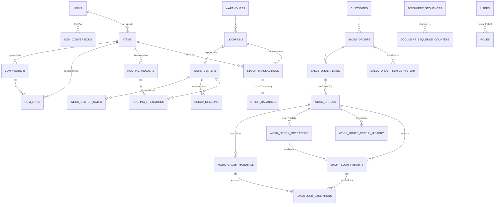

# โครงสร้างฐานข้อมูล

อัปเดตทุกครั้งที่ migration เปลี่ยน ตรวจด้วย `make lint` ว่าไม่มี migration ค้าง

## ภาพรวม



## จุดที่ต้องเข้าใจก่อนแก้อะไร

### `stock_balances` เป็น VIEW ไม่ใช่ตาราง

```sql
CREATE VIEW stock_balances AS
SELECT md5(item_id||':'||location_id||':'||lot_no) AS id,
       item_id, location_id, lot_no, SUM(qty_base) AS qty_on_hand
FROM (
    SELECT item_id, from_location_id AS location_id, lot_no, -qty_base FROM stock_transactions
      WHERE from_location_id IS NOT NULL
    UNION ALL
    SELECT item_id, to_location_id, lot_no, qty_base FROM stock_transactions
      WHERE to_location_id IS NOT NULL
) movements
GROUP BY item_id, location_id, lot_no;
```

ไม่มีคอลัมน์ยอดคงเหลือที่เขียนทับได้ที่ไหนในระบบ วิวนี้สร้างใหม่ได้จากศูนย์เสมอ
และล็อกไม่ได้ — ต้องล็อกแถว `items` เรียงตาม `item_id` ก่อนอ่าน

### `qty` กับ `qty_base` ในตาราง `stock_transactions`

| คอลัมน์ | ความหมาย | แก้ได้ไหม |
|---|---|---|
| `qty` + `uom_id` | ค่าที่ผู้ใช้กรอกจริง | ไม่ — ธุรกรรมเป็น append-only |
| `qty_base` | ค่าเดียวกันในหน่วยนับหลักของ item | ไม่ — คำนวณครั้งเดียวตอนลงธุรกรรม |

เก็บทั้งสองค่าเพราะการสอบย้อนกลับต้องรู้ว่าหน้างานกรอกอะไรมา
แต่การรวมยอดต้องรวมในหน่วยเดียวกัน `qty_base` เป็นค่าที่ derive ได้เสมอ
ไม่ใช่ยอดคงเหลือ — มีเทสต์ยืนยันว่าคำนวณใหม่แล้วตรง

### ทิศทางของแต่ละ `txn_type` (บังคับด้วย CheckConstraint)

| กลุ่ม | txn_type | from | to |
|---|---|---|---|
| ขาเข้าอย่างเดียว | `receipt`, `wo_output` | ว่าง | ต้องมี |
| ขาออกอย่างเดียว | `delivery`, `consume_from_wip` | ต้องมี | ว่าง |
| สองขา | `issue_to_wo`, `return_from_wo`, `transfer`, `scrap` | ต้องมี | ต้องมี |
| ข้างเดียว (อย่างใดอย่างหนึ่ง) | `adjustment` | | |

`wo_output` มีแต่ขาเข้าเพราะเป็นการ **สร้าง** สินค้าจากกระบวนการผลิต
วัตถุดิบที่ค้างใน WIP ถูกตัดด้วย `consume_from_wip` ตอนปิดใบสั่งผลิต
(ดู [ADR-0003](decisions/0003-wip-and-backflush-model.md))

### constraint ที่อยู่ในฐานข้อมูล ไม่ใช่แค่ในโค้ด

| ชื่อ | ตาราง | กันอะไร |
|---|---|---|
| `uniq_client_ref_seq` | `stock_transactions` | ยิงซ้ำแล้วเกิดธุรกรรมซ้ำ |
| `stock_txn_direction_valid` | `stock_transactions` | ทิศทางผิดชนิดธุรกรรม |
| `stock_txn_qty_positive` | `stock_transactions` | จำนวนติดลบหรือศูนย์ |
| `bom_active_no_overlap` | `bom_headers` | BOM ที่ใช้งานอยู่ทับช่วงเวลากัน (EXCLUDE gist) |
| `routing_active_no_overlap` | `routing_headers` | เช่นเดียวกับ BOM |
| `wc_rate_no_overlap` | `work_center_rates` | อัตราค่าแรงทับช่วงเวลากัน |
| `wo_guard_qty_planned_trg` | `work_orders` | แก้ `qty_planned` หลัง released (trigger) |
| `uniq_sequence_period` | `document_sequence_counters` | ตัวนับซ้ำต่องวด |

ทั้งหมดนี้อยู่ที่ฐานข้อมูลเพราะ `clean()` ไม่ทำงานตอน `bulk_create`,
`queryset.update()` หรือ raw SQL

## ตารางทั้งหมด

| แอป | ตาราง |
|---|---|
| `common` | `users`, `roles`, `document_sequences`, `document_sequence_counters` |
| `masterdata` | `uoms`, `uom_conversions`, `items`, `warehouses`, `locations`, `work_centers`, `work_center_rates`, `scrap_reasons`, `customers` |
| `bom` | `bom_headers`, `bom_lines`, `routing_headers`, `routing_operations` |
| `sales` | `sales_orders`, `sales_order_lines`, `sales_order_status_history` |
| `production` | `work_orders`, `work_order_materials`, `work_order_operations`, `work_order_status_history`, `shop_floor_reports`, `backflush_exceptions` |
| `inventory` | `stock_transactions`, `stock_balances` (view) |
| `costing` | ไม่มีตาราง — คำนวณจาก `stock_transactions` และ `work_order_operations` เสมอ |
